# Ticketify - Smart Contract Documentation

## Overview

Ticketify is a decentralized event ticketing platform built on Somnia that allows users to create, manage, and purchase event tickets as NFTs. The platform consists of two main smart contracts that work together to provide a comprehensive ticketing solution.

## 🌐 Live Application

**🎫 [Try Ticketify Now - https://ticketify-phi.vercel.app/](https://ticketify-phi.vercel.app/)**

### 🚀 Getting Started is Easy

1. **Connect Wallet** → 2. **Browse Events** → 3. **Create or Purchase tickets** 

### What You Can Do Right Now

- ✅ **Browse Events**: View all available events on the platform
- ✅ **Create Events**: Deploy your own event contracts with custom details
- ✅ **Purchase Tickets**: Buy NFT tickets for any event
- ✅ **Manage Dashboard**: Track your events and ticket sales
- ✅ **Transfer Tickets**: Send tickets to other users
- ✅ **View NFT Metadata**: See ticket details stored on IPFS

### Quick Access Links

- **Homepage**: [https://ticketify-phi.vercel.app/](https://ticketify-phi.vercel.app/)
- **Create Event**: [https://ticketify-phi.vercel.app/create-event](https://ticketify-phi.vercel.app/create-event)
- **Dashboard**: [https://ticketify-phi.vercel.app/dashboard](https://ticketify-phi.vercel.app/dashboard)
- **All Events**: [https://ticketify-phi.vercel.app/events](https://ticketify-phi.vercel.app/events)

### 🎯 Ticketify Features

- **🎫 NFT Tickets**: Each ticket is a unique ERC-721 token
- **🏭 Factory Pattern**: Dynamic event contract creation
- **💰 Payment Support**: Both free and paid events
- **📱 Responsive Design**: Works on desktop and mobile
- **🔗 IPFS Integration**: Decentralized metadata storage
- **📊 Real-time Dashboard**: Live event and ticket tracking
- **🔄 Ticket Transfers**: Send tickets to other users
- **🌐 Multi-wallet Support**: MetaMask and WalletConnect

```mermaid
sequenceDiagram
    participant U as 👤 User
    participant F as ⚛️ Frontend
    participant P as 📁 Pinata
    participant EF as 🏭 EventFactory
    participant EM as 🎫 EventManager
    participant S as 🌐 Somnia Blockchain
    
    Note over U,S: Event Creation Flow
    U->>F: Create Event Form
    F->>P: Upload Event Image
    P-->>F: Return IPFS Hash
    F->>P: Upload Metadata JSON
    P-->>F: Return Metadata Hash
    F->>EF: createEvent() with IPFS hash
    EF->>EM: Deploy new EventManager
    EM-->>EF: Return contract address
    EF-->>F: Event created successfully
    F-->>U: Event deployed & ready
    
    Note over U,S: Ticket Purchase Flow
    U->>F: Click "Register for Event"
    F->>EM: registerForEvent() with payment
    EM->>EM: Mint NFT ticket
    EM->>EF: recordTicketPurchase()
    EM-->>F: Transaction successful
    F-->>U: NFT ticket received
    
    Note over U,S: Ticket Transfer Flow
    U->>F: Transfer ticket to friend
    F->>EM: transferTicket(to, tokenId)
    EM->>EM: Transfer NFT ownership
    EM-->>F: Transfer successful
    F-->>U: Ticket transferred
```



## 🛠️ Development Setup

### Prerequisites for Local Development

- **Node.js 18+** - [Download here](https://nodejs.org/)
- **MetaMask Wallet** - [Install extension](https://metamask.io/)
- **Foundry** - [Install here](https://book.getfoundry.sh/getting-started/installation)

### Local Development Setup

1. **Clone the Repository**

```bash
git clone https://github.com/your-username/Ticketify.git
cd Ticketify
```

2. **Install Dependencies**

```bash
# Install smart contract dependencies
forge install

# Install frontend dependencies
cd frontend
npm install
```

3. **Configure Environment**

```bash
# Create environment file
cp frontend/.env.example frontend/.env.local

# Add your Pinata API keys (see IPFS Integration section)
# Add your WalletConnect Project ID (optional)
```

4. **Start Development Server**

```bash
cd frontend
npm run dev
```

### Building and Testing

```bash
# Build smart contracts
forge build

# Run tests
forge test

# Run tests with verbose output
forge test -vvv

# Format code
forge fmt
```

### Contract Addresses

**Deployed Contracts on Somnia Testnet:**

- **EventFactory**: `0x70068bC17cb22ad28A2E2df5821d3f4Bf839a800`
- **EventManager**: Dynamically created for each event

## 📁 IPFS Integration

Ticketify uses IPFS to store event metadata using **Pinata** as the IPFS pinning service.

#### Pinata Features Used

- **File Upload**: Upload event images and metadata
- **JSON Metadata**: Store structured ticket information
- **Pinning**: Ensure files remain accessible
- **Gateway Access**: Fast retrieval via Pinata's CDN

### Metadata Structure

Each event ticket includes the following metadata structure:

```json
{
  "name": "Blockchain Conference 2024",
  "description": "Annual blockchain technology conference",
  "image": "ipfs://QmYourImageHash",
  "attributes": [
    {
      "trait_type": "Event Type",
      "value": "Conference"
    },
    {
      "trait_type": "Date",
      "value": "2024-03-15"
    },
    {
      "trait_type": "Location",
      "value": "San Francisco, CA"
    },
    {
      "trait_type": "Ticket Tier",
      "value": "General Admission"
    }
  ],
  "external_url": "https://ticketify.app/events/your-event-id"
}
```

## Smart Contract Architecture

The Ticketify platform is built using a factory pattern with the following core components:

1. **EventFactory** - Central contract for creating and managing events
2. **EventManager** - Individual event contracts that handle ticket sales and management

## Smart Contracts

### 1. EventFactory Contract

The EventFactory is the central hub that manages all events in the platform. It acts as a factory contract that creates individual EventManager contracts for each event.

#### Key Features:

- **Event Creation**: Creates new EventManager contracts for events
- **Global Event Tracking**: Maintains a registry of all events
- **User Management**: Tracks events created by users
- **Ticket Tracking**: Global ticket purchase tracking across all events
- **Event Categorization**: Separates live and past events

#### Core Functions:

##### Event Creation

```solidity
function createEvent(
    string memory _eventName,
    string memory _eventAcronym,
    uint256 _regStartTime,
    uint256 _regEndTime,
    uint256 _ticketFee,
    uint256 _maxTickets,
    string memory _ticketURI
) external returns (address)
```

**Parameters:**

- `_eventName`: Unique name for the event
- `_eventAcronym`: Short identifier for the event(This will be used for the NFT Creation)
- `_regStartTime`: Unix timestamp when registration starts
- `_regEndTime`: Unix timestamp when registration ends
- `_ticketFee`: Cost per ticket (0 for free events)
- `_maxTickets`: Maximum number of tickets available
- `_ticketURI`: IPFS URI for ticket metadata

**Returns:** Address of the created EventManager contract

##### Event Retrieval

```solidity
function getAllEvents() external view returns (address[] memory)
function getLiveEvents() external view returns (EventManager[] memory)
function getPastEvents() external view returns (EventManager[] memory)
function getEventContractByName(string memory eventName) external view returns (address)
```

##### User Management

```solidity
function getUserCreatedEvents(address user) external view returns (EventManager[] memory)
function getUserEventCount(address user) external view returns (uint256)
function getUserAllTickets(address user) external view returns (UserTicket[] memory)
```

##### Ticket Tracking

```solidity
function recordTicketPurchase(address user, uint256 tokenId, string memory eventName) external
function getUserTicketsForEvent(address user, address eventContract) external view returns (uint256[] memory)
```

#### Events:

- `EventCreated`: Emitted when a new event is created
- `TicketPurchased`: Emitted when a ticket is purchased

### 2. EventManager Contract

Each event has its own EventManager contract that handles ticket sales, registration, and management for that specific event.

#### Key Features:

- **ERC721 NFT Tickets**: Each ticket is a unique NFT
- **Registration Management**: Time-based registration windows
- **Payment Handling**: Supports both free and paid events
- **Ticket Transfers**: Allows ticket transfers between users
- **Event Lifecycle**: Manages event start, end, and status

#### Core Functions:

##### Event Information

```solidity
function getEventInfo() public view returns (
    string memory _eventName,
    uint256 _regStartTime,
    uint256 _regEndTime,
    uint256 _ticketFee,
    bool _ticketFeeRequired,
    uint256 _maxTickets,
    uint256 _ticketsSold,
    string memory _ticketURI,
    bool _eventEnded
)
```

##### Registration

```solidity
function registerForEvent() public payable
```

**Requirements:**

- Event must not be ended
- Current time must be within registration window
- Event must not be sold out
- Correct payment amount (if ticket fee required)

##### Ticket Management

```solidity
function transferTicket(address to, uint256 tokenId) public
function getUserTickets(address user) public view returns (uint256[] memory)
```

##### Event Status

```solidity
function isEventLive() public view returns (bool)
function isEventPast() public view returns (bool)
function endEvent() public
```

#### Events:

- `UserRegistered`: Emitted when a user registers for an event
- `EventEnded`: Emitted when an event is ended
- `TicketTransferred`: Emitted when a ticket is transferred

## Testing Framework

The project uses Foundry for testing with comprehensive test coverage.

### Test Structure

The test suite (`test/EventManager.t.sol`) covers:

#### Core Functionality Tests:

- **Event Creation**: Tests event creation through factory
- **Registration**: Tests user registration for events
- **Ticket Transfers**: Tests ticket transfer functionality
- **Payment Handling**: Tests both free and paid events
- **Event Lifecycle**: Tests event start, end, and status

#### Factory Tests:

- **Multiple Event Creation**: Tests creating multiple events
- **User Management**: Tests user event tracking
- **Event Categorization**: Tests live/past event separation
- **Name Uniqueness**: Tests event name uniqueness enforcement

#### Edge Cases:

- **Time-based Registration**: Tests registration window enforcement
- **Sold Out Events**: Tests capacity limits
- **Event Ending**: Tests event lifecycle management

### Running Tests

```bash
# Run all tests
forge test

# Run tests with verbose output
forge test -vvv

# Run specific test
forge test --match-test test_CreateEvent

# Run tests with gas reporting
forge test --gas-report
```

### Test Coverage

The test suite provides comprehensive coverage including:

- ✅ Event creation and management
- ✅ User registration and ticket purchasing
- ✅ Ticket transfers and ownership
- ✅ Payment handling (free and paid events)
- ✅ Event lifecycle management
- ✅ Factory functionality
- ✅ Edge cases and error conditions

## Deployment

The project uses Foundry for development and deployment:

### Build Commands

```bash
# Build contracts
forge build

# Format code
forge fmt
```

#### Deployed Contracts (Somnia Testnet)

**EventFactory Contract**

- **Address**: `0x70068bC17cb22ad28A2E2df5821d3f4Bf839a800`
- **Verification**: [View on Block Explorer](https://shannon-explorer.somnia.network/address/0x70068bC17cb22ad28A2E2df5821d3f4Bf839a800)
- **ABI**: Available in `frontend/app/contracts/abis/EventFactory.json`

**EventManager Contracts**

- **Creation**: Dynamically created for each event
- **Verification**: Each contract is verified upon creation
- **ABI**: Available in `frontend/app/contracts/abis/EventManager.json`

## Usage Examples

### Creating an Event

```solidity
// Create a free event
address eventAddress = eventFactory.createEvent(
    "Blockchain Conference 2024",
    "BC24",
    block.timestamp + 86400, // Start in 1 day
    block.timestamp + 604800, // End in 1 week
    0, // Free event
    1000, // Max 1000 tickets
    "ipfs://QmYourMetadataHash"
);

// Create a paid event
address paidEventAddress = eventFactory.createEvent(
    "VIP Workshop",
    "VIP",
    block.timestamp + 3600, // Start in 1 hour
    block.timestamp + 86400, // End in 1 day
    0.1 ether, // 0.1 ETH per ticket
    50, // Max 50 tickets
    "ipfs://QmYourVIPMetadataHash"
);
```

### Registering for an Event

```solidity
// Register for free event
EventManager(eventAddress).registerForEvent();

// Register for paid event
EventManager(paidEventAddress).registerForEvent{value: 0.1 ether}();
```

### Transferring Tickets

```solidity
// Transfer ticket to another user
EventManager(eventAddress).transferTicket(recipientAddress, tokenId);
```

### Querying Events

```solidity
// Get all events
address[] memory allEvents = eventFactory.getAllEvents();

// Get live events
EventManager[] memory liveEvents = eventFactory.getLiveEvents();

// Get user's tickets
UserTicket[] memory userTickets = eventFactory.getUserAllTickets(userAddress);
```
